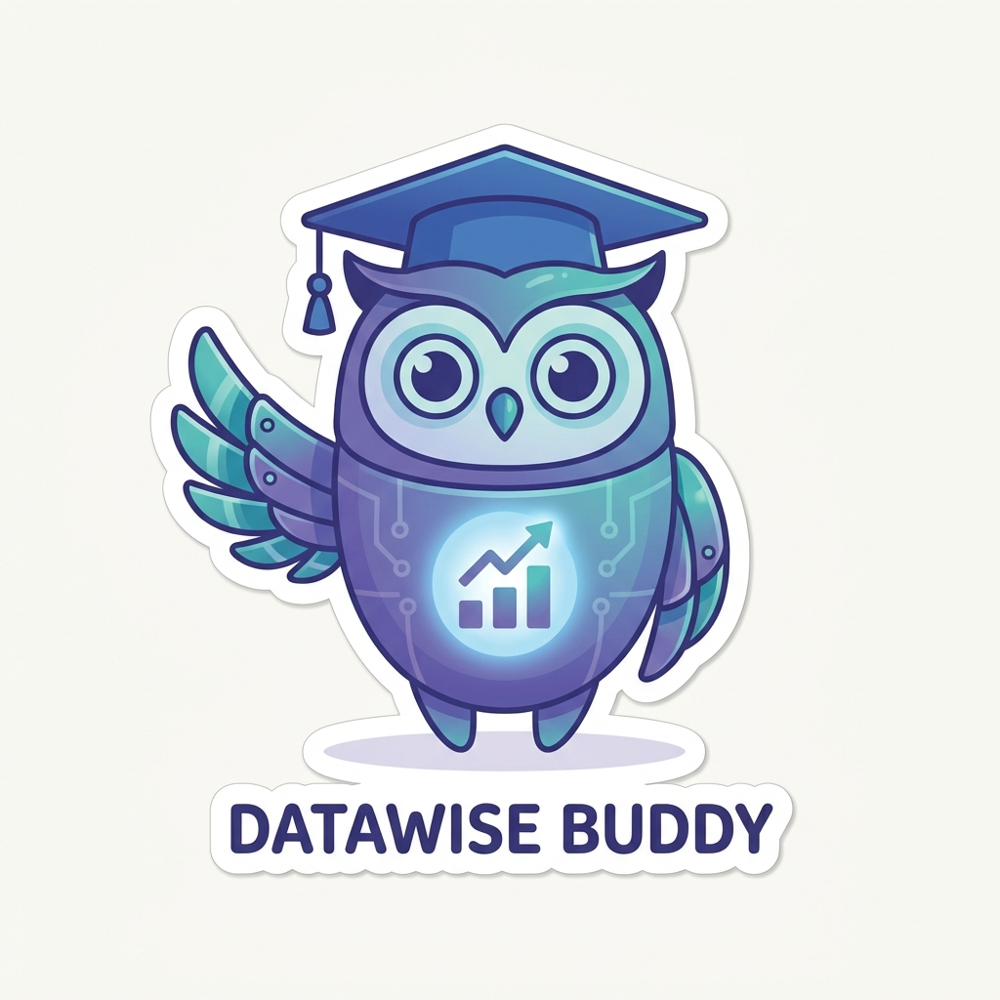

<p align="center">
  
</p>

<h1 align="center">iPAS 備考學院</h1>

<p align="center">
  <b>一站搞定 iPAS 三張證照的備考</b><br/>
  AI 應用規劃師（初級・中級）× 營運智慧分析師 BI（初級）<br/>
  <i>Practice smarter. Pass faster.</i>
</p>

<p align="center">
  <a href="https://ipas.tun9i.com"></a>
</p>

<p align="center">
  
  
  
  
  
</p>

---

## 這是什麼？

**iPAS 備考學院**是一個為台灣 iPAS 產業人才能力鑑定打造的線上刷題平台。把散落各處的官方歷屆題與網路題庫，整理成一個**乾淨、快速、能離線用、跨裝置同步**的練習系統——而且**零廣告、零安裝、開網頁就能用**。

一套程式碼、三張證照，開箱即用：

| 認證 | 級別 | 路徑 |
|---|---|---|
| AI 應用規劃師 | 初級 | [`/junior`](https://ipas.tun9i.com/junior/) |
| AI 應用規劃師 | 中級 | [`/intermediate`](https://ipas.tun9i.com/intermediate/) |
| 營運智慧分析師（BI） | 初級 | [`/bi`](https://ipas.tun9i.com/bi/) |

---

## ✨ 特色

- 📚 **官方＋網路雙題庫** — 官方歷屆題與網路蒐集題**嚴格分桶**：模擬考可只考官方歷屆，平時練習可全都來。每題標示出處。
- 📝 **多種練習模式** — 題庫練習（作答即看解析）、**模擬考**（比照官方 50 題 / 75 分鐘）、錯題複習、收藏複習。
- 🧠 **每題內建解析** — 不需要自己再去查，答完立刻懂。
- 📊 **成績判讀** — 各科正確率、最需加強的主題、個人化加強建議。
- 📈 **成長曲線** — 題目加權的平均正確率、累積作答量、近期趨勢（不被單場難度誤導）。
- 🔌 **PWA 離線可用** — 加到主畫面像 App 一樣用，沒網路也能刷題。
- ☁️ **跨裝置雲端同步** — 登入後手機、電腦進度自動同步（Supabase）。
- 🌗 **深淺色主題** — 全站主題感應，跨認證同步。
- 🛡️ **隱私友善** — 無 cookie 追蹤、無第三方廣告。
- 📊 **管理後台** — 內建 `/admin` 使用統計儀表板（總人數、各認證、每日活躍、個別學習者下鑽）。

---

## 🛠️ 技術棧

刻意走**極簡、零建置、零框架**路線，載入快、好維護：

- **前端**：Vanilla JS SPA（頁面內切換）+ 手寫 CSS 設計系統，**無框架、無前端打包流程**；npm 僅用於開發驗證與部署工具
- **PWA**：Service Worker（首頁與圖示預快取、導覽逾時退快取、JS/CSS 與題庫在首次線上載入後快取）
- **動畫**：GSAP + Lottie（在地化，離線可用）
- **雲端**：Supabase（Auth + Postgres，跨裝置同步、RLS 保護）
- **部署**：Cloudflare Workers，Worker 名稱 `ipas-study`，自訂網域 `ipas.tun9i.com`
- **載入**：官方題庫先載入，擴充題庫延遲載入；圖片與影片依頁面需要下載

---

## 🏗️ 架構一覽

```
GitHub (main)  ──手動部署──▶  Cloudflare Worker ipas-study  ──▶  ipas.tun9i.com
                                                     │
                     ┌───────────────┬───────────────┼───────────────┐
                  Portal          junior        intermediate         bi
                （入口）      （AI 初級）      （AI 中級）      （BI 初級）
                     └───────────────┴───────────────┴───────────────┘
                                 每個 app = 同構 PWA SPA
   殼：index.html / style.css / service-worker.js
   執行層：app.js（路由）· quiz.js · analysis.js · charts.js
   資料層：content-api.js  ──▶  content.js（官方題）＋ bank.js（網路題）
   儲存：store.js → localStorage  │  cloud.js → Supabase（背景同步）
```

**資料分離原則**：官方歷屆題放 `content.js`（無 `generated` 標記）；網路蒐集題放 `bank.js`（自動標 `generated:true` 並附出處）。兩者永不混用，讓「只考官方歷屆」成為可靠選項。

---

## 🚀 本機開發

純靜態站，不需建置。任何靜態伺服器即可：

```bash
# 用 Python
python -m http.server 8000
# 或 Node
npx serve .
```

然後開 `http://localhost:8000/junior/`。GitHub 儲存原始碼；正式站由 Cloudflare Worker 提供服務。推送 `main` 不等於已部署，請依下方部署步驟更新正式站。

> PWA 換版特性：改動 JS/CSS 需 bump `?v=` 與 service worker 的 `CACHE` 版本；純 `index.html` 改動免 bump。

---

## 📊 管理後台

`/admin` 是獨立的使用統計後台：總使用者、近 7/30 天同步活躍、各認證人數與累積作答，並可**點入個別學習者**檢視測驗紀錄。管理者可見姓名、Email 與作答明細，並非匿名統計。`usage_stats()` 與 `user_attempts(text)` 在資料庫端檢查登入者是否為指定管理信箱；未登入者不能執行，一般登入者也不能取得管理報表。

活躍數字目前依每筆狀態的最後同步時間計算；每日圖表不是完整的歷史登入或作答事件紀錄。

### 建立 Supabase 後端

1. 在 Supabase SQL Editor 以專案管理者身分執行根目錄的 `supabase-setup.sql`。此檔包含 `user_state`、本人資料 RLS、兩個管理報表函式與必要授權，可重複執行且不刪除現有紀錄。
2. 若要更換管理者，修改 SQL 內**兩個**函式的 `admins` 信箱陣列後重新執行；不要移除函式中的授權檢查。
3. 若建立新 Supabase 專案，更新根目錄 `index.html`、`admin/index.html` 及三站 `assets/js/cloud.js` 的 `SB_URL`、`SB_KEY`。前端只可使用公開 publishable／anon key，不能放 `service_role` 或 secret key。
4. 啟用 Email 登入，將正式網域及需要的登入返回網址加入 Supabase Auth 的 Site URL／Redirect URLs；本機驗證時另加入本機來源。寄信與 OTP 範本需在 Supabase Auth 設定，SQL 不會設定寄信服務。

### 後端驗證

```bash
npm ci
npm test
```

測試使用獨立的 PGlite PostgreSQL 與合成學習紀錄，驗證管理員查詢、一般使用者拒絕、匿名拒絕、本人資料隔離與重複建置；不連接或修改正式資料庫。

## ☁️ 部署到 Cloudflare Workers

`wrangler.jsonc` 保存目前正式 Worker 的名稱、自訂網域、靜態檔案路由與觀測設定。需使用 Node.js 22 或更新版本。

```bash
npm ci
npm test
npm run deploy:dry-run
npx wrangler login
npm run deploy
```

`npm run build` 只把網站公開檔案複製到 `dist/`，不打包或改寫前端。SQL、測試、文件、套件、Git 資料與舊 Netlify 函式不會部署成公開檔案。`npm run deploy` 使用固定版本的 Wrangler 發布，更新前會檢查設定與目前線上版本是否有差異。

目前採手動部署，未設定 Git 自動建置。部署後應開啟正式站確認內容與快取換版；修改 GitHub 的 `main` 本身不會執行上述步驟。

---

## 🗺️ Roadmap

- [ ] 營運智慧分析師（BI）官方歷屆題：待 **115/10/31 首考**公告後補入
- [ ] 更多網路題庫來源與去重
- [ ] 練習頁層級的事件統計

---

## 📄 授權與聲明

本專案程式碼為個人作品。**題庫內容之著作權另屬原出處**（iPAS 官方公告試題／各網路來源），僅供學習研究使用，請勿作商業用途。

<p align="center"><sub>Made with ☕ &amp; Vanilla JS · <a href="https://ipas.tun9i.com">ipas.tun9i.com</a></sub></p>
